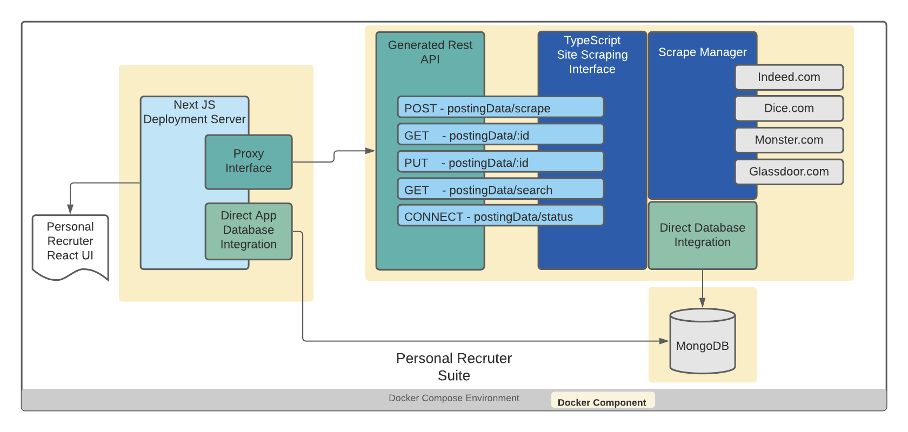

# Personal Recruiter

## Software Development Plan

### Primary Goals

- find more granular opportunities in the market for a specialization (ie. full stack engineer & angular)
- general salary data broken out by useful demographics
- facilitate a job search across multiple locations

### Overview

#### Design Goals:

To create a reasonably modular system for the collection of Job Posting Data and being able to extract useful aggregate data out of it.  

Defining primary interfaces as service contracts.

## Technical Agile Task Breakdown

- *[global]* Setup a consolidated development environment
- *[data service]* Basic project setup with a test case driver
  - *[data service]* Define primary Data Transport Objects and scaffold the orchestration layer
    - *[POC]* Implement the first scrape-able data source
    - *[impl]* Implement the remaining data sources with "lessons learned"
  - *[impl]* Implement a Data Access Layer
  - *[data service]* Define OpenAPI specification
    - *[setup]* Generate API scaffolding
    - *[impl]* Implement custom endpoints
- *[database]* Stand up & document deployment procedures + data retention strategy
- *[web service]* Basic project setup
  - *[impl]* Build out basic ReactJS UI components
  - *[impl]* Implement a Data Access Layer, (application config as minimum)
  - *[impl]* Circuit break & Proxy to data service
  - *[impl]* Basic test case coverage
- *[global]* Setup a consolidated deployment environment